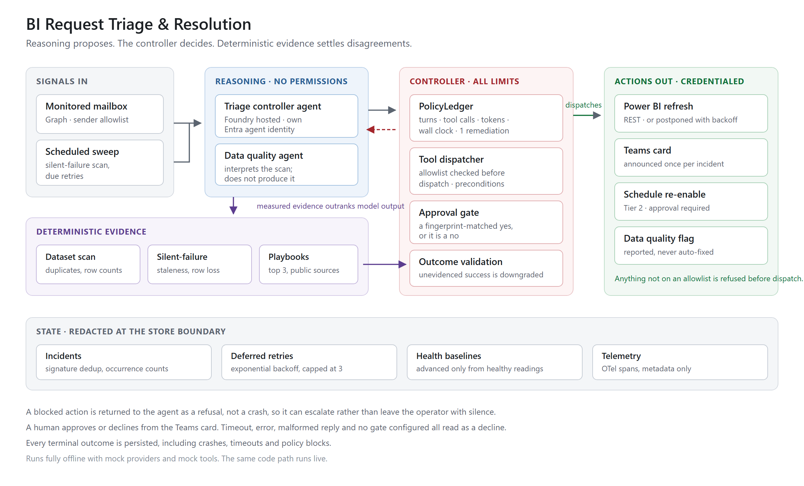

# BI Request Triage & Resolution

A multi-agent solution accelerator for Azure AI Foundry. A Power BI failure
alert arrives in a monitored mailbox; a controller agent gathers evidence,
consults a data quality agent, and either takes one bounded remediation, asks a
human for approval, or refuses and escalates.

It runs **fully offline** with mock providers and mock tools — no tenant, no
Azure login, no network — and the same code path runs live against Microsoft
Graph, Power BI and Teams when you configure it.

[**Scenarios**](#scenarios) &nbsp;|&nbsp;
[**Quick start**](#quick-start) &nbsp;|&nbsp;
[**Deploy to Azure**](#deploy-to-azure) &nbsp;|&nbsp;
[**Architecture**](docs/architecture.md) &nbsp;|&nbsp;
[**Walkthrough**](walkthrough/WALKTHROUGH.html) &nbsp;|&nbsp;
[**Security**](SECURITY.md) &nbsp;|&nbsp;
[**FAQ**](docs/faq.md)

---

## Solution overview

A refresh fails at 06:02. The alert goes to a distribution list. Someone opens
the workspace, reads the error, decides whether a retry is worth trying, and
either retries it or finds the person who owns the dataset. On a bad morning
that takes an hour, and the same failure will happen again next week.

This accelerator automates the parts of that loop that are deterministic, and
refuses to automate the parts that are not.

| | |
|---|---|
| **What it does** | Reads a failure alert, retrieves matching failure-mode playbooks, runs a deterministic data scan, decides on an action, and reports the outcome to Teams |
| **What it will not do** | Take more than one remediation per incident, call a tool that is not on an allowlist, apply a Tier 2 fix without an explicit human approval, or report success it cannot evidence |
| **Where the limits live** | In the controller (`policy.py`, `tools/registry.py`), not in prompt wording |
| **What runs it** | An Azure AI Foundry hosted agent with its own Entra agent identity, on a schedule |
| **What it costs to try** | Nothing. The offline path needs no Azure resources at all |

### Architecture



Three components, deliberately separated:

- **Reasoning agents** (`agents/`) hold prompts and tool schemas. They hold **no
  permissions at all**. They report; they do not decide.
- **The controller** (`policy.py`, `tools/registry.py`) holds every limit and
  every credential. It charges budgets before an action, checks preconditions,
  and dispatches only allowlisted actions.
- **Deterministic detectors** (`tools/dataset.py`, `detectors/silent_failures.py`)
  produce measured evidence. Where a model claim and a scan disagree, the scan
  wins and the disagreement is logged.

Full detail in [`docs/architecture.md`](docs/architecture.md); what runs where in
Azure and under which identity is in
[`docs/hosted-architecture.md`](docs/hosted-architecture.md).

---

## Scenarios

Each scenario is a YAML file with an `expect` block, and each one is a test. The
first two are the requested behaviour; the rest determine whether the system is
trustworthy.

| Scenario | What it shows |
|---|---|
| `scenario1-transient` | Transient failure → one refresh → resolved |
| `scenario2-data-quality` | Duplicates found → flagged and notified → **no automated fix** |
| `scenario2b-known-issue` | Same alert twice → second suppressed, occurrence counted |
| `scenario3-policy-block` | Agent attempts a second remediation → **controller refuses** |
| `scenario4-unknown-action` | Agent proposes an unlisted action → **never dispatched** |
| `scenario5-approval-granted` | Repeating failure → larger fix proposed → **human approves** → applied |
| `scenario6-approval-denied` | Same, but the **human declines** → nothing happens |
| `scenario7-schedule-reenable` | Refresh schedule disabled after repeated failures → re-enabled under approval |
| `scenario8-capacity-backoff` | Capacity throttled → retry **postponed**, not attempted |

Two capabilities run outside the alert-driven path:

- **Silent failure detection** (`triage-demo health`) finds models that are
  stale or have lost rows but sent no alert, because the refresh reported
  success. A failure that raises no alert is the one that reaches a report.
- **Deferred retries** (`triage-demo retries`) reschedule a throttled refresh
  with exponential backoff rather than retrying immediately, which would extend
  the outage it is responding to.

---

## Quick start

No Azure account, no credentials, no network.

```powershell
python -m venv .venv
.\.venv\Scripts\python.exe -m pip install -e ".[dev]"

.\.venv\Scripts\triage-demo.exe list
.\.venv\Scripts\triage-demo.exe run scenario1-transient
.\.venv\Scripts\triage-demo.exe run scenario2-data-quality --show-data
.\.venv\Scripts\triage-demo.exe run scenario3-policy-block
```

Other commands:

```powershell
triage-demo preflight      # what is configured and what is missing
triage-demo incidents      # the incident store, redacted at the boundary
triage-demo flags          # the data quality flag table
triage-demo approvals      # actions awaiting a human decision
triage-demo retries        # retries the agent postponed, and when they are due
triage-demo health         # scan for failures that never raised an alert
triage-demo tools          # the exact tool schemas the model is given
triage-demo identity --check-scope    # who the agents are, read from the directory
```

---

## Deploy to Azure

### Prerequisites

| Requirement | Notes |
|---|---|
| Azure subscription | With permission to create an AI Foundry project |
| [Azure Developer CLI](https://aka.ms/azd) | `azd` drives the deployment |
| Python 3.11+ | |
| An Entra app registration | For Graph mail, Power BI and Teams — see [`docs/provisioning.md`](docs/provisioning.md) |
| A model deployment | Defaults to `gpt-4.1`; see [`docs/model-selection.md`](docs/model-selection.md) |

### Cost

The offline path costs nothing. Running live, recurring cost is dominated by
model tokens, and the policy budgets bound it directly: a run is capped on turns,
tool calls and tokens, so one incident cannot become an open-ended bill. Azure
Table Storage for the incident, retry and baseline stores is negligible. Foundry
hosted agent compute is billed per invocation. Confirm current rates with the
[Azure pricing calculator](https://azure.microsoft.com/pricing/calculator/) —
prices change, and any figure printed here would go stale.

### Deploy

```powershell
azd auth login
azd env new bi-triage

# every tenant-specific value in azure.yaml is parameterised
azd env set AZURE_AI_PROJECT_ENDPOINT "https://<project>.services.ai.azure.com/api/projects/<name>"
azd env set AZURE_TENANT_ID "<tenant-guid>"
azd env set GRAPH_MAILBOX "<monitored-mailbox-upn>"
azd env set GRAPH_SENDER_ALLOWLIST "<who-is-allowed-to-trigger-it>"

azd up
azd ai agent invoke bi-triage-controller "sweep"
azd ai agent monitor bi-triage-controller
```

What must exist in the tenant first is in
[`docs/provisioning.md`](docs/provisioning.md); the end-to-end live sequence is
in [`docs/run-sheet.md`](docs/run-sheet.md).

### Running modes

Two independent switches, which can be mixed:

- `TRIAGE_PROVIDER_MODE` = `mock` | `direct` | `foundry` — who does the reasoning
- `TRIAGE_TOOL_MODE` = `mock` | `live` — whether tools reach real services

`provider=mock, tools=live` is genuinely useful: real refreshes and real Teams
messages, deterministic reasoning. It is the dress-rehearsal configuration.

---

## Design decisions

These are the parts worth reading before adapting this to another domain.

**Limits live in the controller, not the prompt.** `PolicyLedger` charges every
turn and every tool call before it happens, **across every agent in the run** —
the data quality agent shares the same ledger. One remediation per run, a
tool-call budget, a token budget, a wall clock, and an allowlist. No wording
change raises any of them.

**A refusal is data, not a crash.** When the controller blocks an action it
returns the refusal *to the agent*, which can then escalate to a human. Killing
the run at that moment would leave the operator with silence.

**Retrieved knowledge, not a bigger prompt.** A catalogue of documented failure
modes lives in `knowledge/playbooks.py`; only entries whose triggers match the
incoming error are injected, capped at three. Each states whether a retry is
*useful*, which is the part that changes the decision. "Credentials expired" and
"capacity throttled" both surface as "refresh failed", but retrying fixes one and
wastes capacity on the other.

**Deterministic evidence beats model assertion.** Duplicate detection is a plain
CSV scan. The data quality agent interprets the numbers; it does not produce
them. If the model contradicts the scan, the scan wins, its prose is discarded,
and the disagreement is logged — see
`test_contradicted_denial_discards_the_models_prose`.

**Success has to be earned.** If the agent reports `resolved` but no remediation
succeeded, `flagged_data_quality` but no flag row was written, or
`duplicate_suppressed` but no open incident matched, the controller downgrades it
to `needs_human`. This is not hypothetical: a production deployment shipped a
recovery agent that reported "Fixed" three times in a row while the underlying
job kept failing.

**Every terminal outcome is persisted** — crashes, timeouts and policy blocks
included, not only successes. The same system originally recorded only successful
recoveries and consequently missed 10 agent crashes over two weeks.

**Repeats are suppressed by signature.** A 16-character hash over an error
normalised of GUIDs, timestamps and IDs. The second alert increments a counter
instead of triggering a second fix. Announcement is deduplicated too: an incident
is announced once, not once per occurrence, because deduplication that stops the
remediation but not the notification produces exactly the alert fatigue this
exists to remove.

**Approval fails closed.** Every path that is not an explicit,
fingerprint-matched, unexpired, unused "yes" is a no — timeout, error, malformed
reply and no gate configured all read as refusal. A denial does not consume the
remediation budget, or one "no" would silently disarm the agent for the rest of
the incident.

**The inbox filter is a security control.** An agent that acts on every message
is steerable by anyone who can email it. The filter fails closed, including when
its own pattern is invalid, and counts what it ignored rather than dropping it
silently.

**Permissions belong to the component that acts, not the one that reasons.** The
prompt agents hold nothing. Each agent has its own identity, so each needs its
own grant. Identity claims are read live from the directory rather than
configured — a hardcoded claim about security posture eventually becomes false
without anyone noticing.

**Tools fail loudly rather than return something interpretable.** Calling Power
BI with an empty id returned 404, and the model turned that into a confident,
wrong conclusion. Inputs are validated at the boundary: a plausible answer built
on a failed call is the worst available outcome.

---

## Repository layout

```
src/triage_demo/
  policy.py            TriagePolicy + PolicyLedger      <- the safety story
  approvals.py         Human-in-the-loop gates          <- fail-closed by design
  knowledge/
    playbooks.py       Retrieved failure-mode catalogue <- public sources only
  signature.py         Failure signatures for dedup
  redaction.py         Secret patterns, applied at the store boundary
  models.py            Typed contracts for every agent boundary
  observability.py     OTel GenAI spans (no-op without the SDK)
  prompts.py           Prompt loading + version hashing
  runner.py            Scenario orchestration, sweeps, retry draining
  cli.py               The on-screen surface
  agents/
    triage_agent.py    Orchestrator + controller loop
    data_quality_agent.py
    prompts/*.md       System prompts (hashed onto every incident)
  detectors/
    silent_failures.py Deterministic scan for failures that sent no alert
  tools/
    registry.py        Tool schemas + the dispatcher that enforces policy
    dataset.py         Deterministic duplicate detection
    flags.py           The data quality flag table
    powerbi.py         Refresh via REST (mock + live)
    semantic_health.py Read-only model health queries (mock + live)
    teams.py           Resolution summary (mock + webhook)
    inbox.py           Graph polling + mock inbox
  providers/
    mock.py            Scripted, deterministic -- offline rehearsal
    azure_openai.py    Chat completions, client-side tools
    foundry.py         Foundry agents, both handoff shapes
  store/
    incidents.py       Dedup, occurrence counting, redaction
    retries.py         Deferred retries with exponential backoff
    semantic_health.py Health baselines, advanced only from healthy readings

scenarios/*.yaml       Runnable scenarios, each with assertions
mock/                  Seeded data and inbox messages
scripts/               Agent registration, capture, packaging
docs/                  Architecture, run sheet, FAQ, provisioning
tests/                 The offline suite; test_hardening.py pins regressions
```

---

## Documentation

| Question | File |
|---|---|
| How does it work, and why is it built this way? | [`docs/architecture.md`](docs/architecture.md) |
| What runs where in Azure, under which identity? | [`docs/hosted-architecture.md`](docs/hosted-architecture.md) |
| Which Foundry features are native vs. hand-rolled? | [`docs/foundry-native-architecture.md`](docs/foundry-native-architecture.md) |
| What has to exist in the tenant first? | [`docs/provisioning.md`](docs/provisioning.md) |
| How do I run it live, end to end? | [`docs/run-sheet.md`](docs/run-sheet.md) |
| Why this model, and what if it is unavailable? | [`docs/model-selection.md`](docs/model-selection.md) |
| Common questions | [`docs/faq.md`](docs/faq.md) |
| What do I hand over afterwards, and what must not go in it? | [`docs/handoff.md`](docs/handoff.md) |
| Annotated screenshots of real runs | [`walkthrough/WALKTHROUGH.html`](walkthrough/WALKTHROUGH.html) |
| The same runs from the user's point of view | [`walkthrough/PERSONAS.html`](walkthrough/PERSONAS.html) |
| Rules for AI agents working in this repo | [`AGENTS.md`](AGENTS.md) |
| How to contribute | [`CONTRIBUTING.md`](CONTRIBUTING.md) |

The walkthrough pages are self-contained: the stylesheet and every screenshot are
embedded. That is what makes them shareable. SharePoint and Teams render an
`.html` through a preview host that blocks external stylesheets and images and
reports nothing, so a page with linked assets arrives unstyled, with empty
figures and no explanation. Share the link the **Share** button gives you; a raw
file path downloads the file rather than previewing it.

```powershell
.\.venv\Scripts\python.exe scripts\capture_walkthrough.py
.\.venv\Scripts\python.exe scripts\inline_assets.py   # re-embed the new captures
.\.venv\Scripts\python.exe scripts\preview_check.py   # render under the preview policy
```

Skipping the second step leaves the shared copy showing the previous
screenshots; `tests/test_walkthrough_sandbox.py` fails if that happens.

---

## Tests

```powershell
.\.venv\Scripts\python.exe -m pytest -q
.\.venv\Scripts\python.exe -m ruff check .
```

The suite is entirely offline: no credentials, no tenant, no network. A test that
needs a tenant is not a test.

The scenario tests run the same code path the demo runs, so if they pass, the
demo works — that is the entire reason they exist. Each safety property also has
a **negative control**: a test that fails when the guard is removed. A guard with
no failing test is an assumption.

---

## Security

- No credential, webhook URL or callback URL is committed. CI runs a credential
  scan over git-tracked files on every push
  (`python scripts/build_handoff.py --scan-only`).
- Secrets are redacted **inside the store boundary**, never at call sites — a
  call site can forget.
- Telemetry spans carry metadata only, never prompt or completion content.
- Authentication uses managed identity or federated credentials.

To report a vulnerability, see [`SECURITY.md`](SECURITY.md).

---

## Responsible AI

The model proposes; it does not have authority. Every action it can take is on an
allowlist enforced before dispatch, bounded by budgets it cannot raise, and
validated against deterministic evidence afterwards. Anything beyond a single
low-risk remediation requires an explicit human approval that fails closed.

This is a starting point for your own risk assessment, not a completed one.
Before running it against production data, review the tiering of every action for
your environment, confirm who is permitted to trigger the agent by email, and
decide which failures must always reach a human. See
[`TRANSPARENCY_FAQ.md`](TRANSPARENCY_FAQ.md).

---

## Provenance

The policy ledger, failure signatures, redaction patterns, incident model and the
"validate the outcome against the evidence" rule are ported from a **production
Fabric operations platform**, where equivalents run against real Microsoft Fabric
deployments. The comments call out which production incident motivated each one.
Those are the details worth keeping, because they are the ones nobody arrives at
from first principles.

---

## Disclaimer

This accelerator is sample code, provided under the [MIT licence](LICENSE). It is
not a supported Microsoft product and carries no SLA. You are responsible for
reviewing, testing and securing it before any production use, and for the cost of
the Azure resources it provisions.
